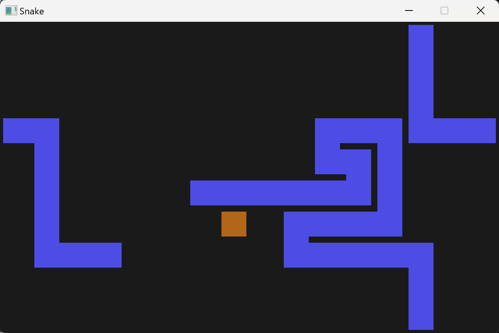

# snake-rs
A simple snake game implemented in Rust and Piston

## Running the program
Assuming cargo is installed, it can be built and run rith ```cargo run --release``` after cloning the repo.

### Controls
WASD - Movement \
Esc - Pause \
Space - Reset after game over

## Screenshots

